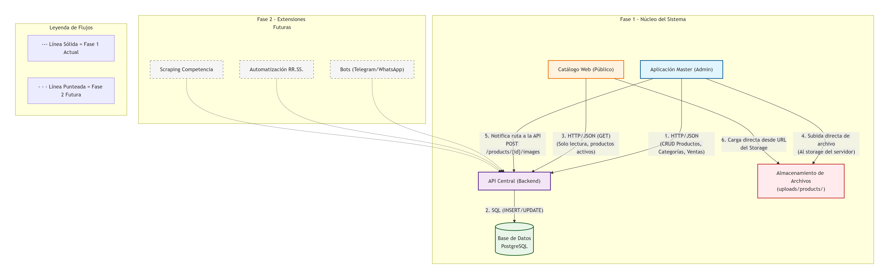

Se puede ver ne chat gpt proyectos maybel redacción idea negocio

A continuación te presento el INFORME TÉCNICO–FUNCIONAL DEL PROYECTO, redactado como documento serio de arquitectura, dejando clarísimo:
•	Qué se va a construir
•	Qué hace cada componente
•	Cómo se comunican
•	Qué rol cumple la API
•	Cómo se visualiza el catálogo (categorías / subcategorías / productos)
•	Qué entra en esta fase y qué no
He evitado adornos y me he centrado en arquitectura correcta y realista.
________________________________________
INFORME DEL PROYECTO
Plataforma Maybel – Sistema Centralizado de Catálogo, Gestión e Inteligencia Comercial
________________________________________

1. Planteamiento general del negocio
La idea es construir un ecosistema digital interconectado para la gestión y promoción de productos físicos (electrodomésticos, muebles, vehículos, etc.) orientado al mercado cubano, sin depender de pasarelas de pago y priorizando catálogo, contacto y distribución de información.
El sistema se basará en una aplicación central (“Maybel – Master”) que actuará como fuente única de la verdad, desde donde se gestionan productos, inventario, precios y análisis de datos.
A partir de esta aplicación, la información se distribuirá automáticamente a otros canales:
•	Página web pública (catálogo)
•	Canal y bot de Telegram
•	WhatsApp (atención y pedidos)
•	Publicaciones automatizadas en redes sociales (Facebook, Instagram, Revolico)
En la primera fase NO se incluyen pagos en línea ni automatización de redes sociales. Eso se incluirá mas tarde aunque lo del pago en línea al estar en cuba probablemente nunca
________________________________________
2. Visión general de la arquitectura
Principio rector
Una sola fuente de datos, múltiples consumidores, acceso controlado
La base de datos no es accedida directamente por las aplicaciones, sino exclusivamente a través de una API, que actúa como capa de control y validación.
________________________________________
Arquitectura general
******

 Las imágenes se almacenan en storage de archivos, no en la base de datos.
________________________________________
3. Componentes del sistema
________________________________________
3.1 API (Componente central)
Rol
La API es el núcleo del sistema.
Toda interacción con los datos pasa por ella.
Funciones principales
•	Crear, leer, actualizar y eliminar:
o	Categorías
o	Subcategorías
o	Productos
o	Imágenes
o	Ventas
•	Validar datos
•	Aplicar reglas de negocio
•	Exponer datos al catálogo de forma controlada
•	Servir como punto único de integración futura
Características técnicas
•	API REST
•	Comunicación HTTP
•	Respuestas en JSON
•	Endpoints separados para:
o	Administración (Master)
o	Lectura pública (Catálogo)
________________________________________
3.2 Base de Datos (PostgreSQL)
Rol
Almacenar exclusivamente datos estructurados, no archivos.
Qué almacena
•	Productos
•	Categorías y subcategorías
•	Precios
•	Stock
•	Ventas
•	Referencias a imágenes (rutas / URLs)
Qué NO almacena
•	Imágenes
•	Archivos binarios
________________________________________
3.3 Almacenamiento de imágenes (File Storage)
Rol
Guardar los archivos físicos de imágenes.
Funcionamiento
•	Las imágenes se guardan en el servidor:
•	/uploads/products/{product_id}/
•	La base de datos guarda únicamente:
o	Ruta
o	Orden
o	Relación con el producto
Esto permite:
•	Carga rápida
•	Backups simples
•	Escalabilidad
________________________________________
3.4 Aplicación Master (Administración)
Rol
Es la interfaz administrativa completa del sistema.
Funciones
•	Crear categorías y subcategorías
•	Crear productos
•	Subir y eliminar imágenes
•	Modificar precios y stock
•	Eliminar productos
•	Registrar ventas
•	Visualizar estadísticas y análisis de datos
Comunicación
•	Se comunica exclusivamente con la API
•	No accede directamente a la base de datos
________________________________________
3.5 Catálogo Web (Público)
Rol
Mostrar los productos disponibles de forma clara y organizada.
Funciones
•	Navegar por categorías
•	Navegar por subcategorías
•	Visualizar productos
•	Ver precios e imágenes
•	Búsqueda básica
Restricciones
•	Solo lectura
•	Solo productos activos
•	No permite modificaciones
Comunicación
•	Consume endpoints públicos de la API
•	No accede directamente a PostgreSQL
________________________________________
4. Flujo de comunicación entre componentes
________________________________________

Todo el código que sale en esta etapa es pseudocodigo porque aun no se ha definido el modelo de datos de la api
Paso 1: Crear producto (solo datos)
Desde el Master:
POST /products
Content-Type: application/json

{
  "name": "Bicicleta MTB Aro 26",
  "description": "Bicicleta de montaña",
  "price": 150.00,
  "stock": 5,
  "category_id": "uuid"
}
La API:
•	Valida
•	Inserta en PostgreSQL
•	Devuelve:
{
  "id": "product_uuid"
}
________________________________________
Paso 2: Subir imágenes (Master → Storage)
El Master:
•	Guarda directamente el archivo en:
•	/uploads/products/{product_uuid}/1.webp
•	Esto no pasa por la API
________________________________________
Paso 3: Registrar imagen en la base
Luego el Master notifica a la API:
POST /products/{product_uuid}/images
Content-Type: application/json

{
  "file_path": "/uploads/products/{product_uuid}/1.webp",
  "position": 1
}
La API:
•	Guarda la referencia en PostgreSQL
•	Devuelve confirmación
________________________________________
Paso 4: Visualización en catálogo
El catálogo:
1.	Pide productos a la API
2.	Recibe URLs de imágenes
3.	El navegador carga las imágenes directamente desde el storage
________________________________________
4. Por qué este diseño es el mejor (razones técnicas)
✔️ Separación de responsabilidades
✔️ Mejor manejo de errores
✔️ No se suben archivos innecesariamente
✔️ Control total desde el Master
✔️ Más fácil de mantener
✔️ Más seguro
La API no maneja archivos, solo datos.
________________________________________
5. Redacción profesional para el informe (tal como pediste)
Ahora te dejo el texto bien redactado, listo para reemplazar la sección del informe.
________________________________________
Flujo de creación de productos e imágenes (definitivo)
La creación de un producto se realiza en dos etapas claramente separadas, con el objetivo de mantener una arquitectura limpia y robusta.
Etapa 1 – Creación del producto (datos estructurados)
El usuario introduce desde la interfaz del sistema Master los datos básicos del producto, tales como nombre, descripción, precio, stock y categoría.
El sistema Master envía únicamente los datos estructurados al backend mediante la API, utilizando un endpoint de creación de productos. La API valida la información recibida y persiste el producto en la base de datos PostgreSQL, devolviendo al Master el identificador único del producto recién creado.
Etapa 2 – Gestión de imágenes del producto
Una vez creado el producto, el sistema Master se encarga directamente de la gestión de las imágenes asociadas. Las imágenes son almacenadas como archivos en el sistema de almacenamiento del servidor, organizadas en rutas específicas por producto.
Posteriormente, el sistema Master notifica a la API la ubicación de cada imagen almacenada, enviando únicamente la referencia a la ruta del archivo. La API registra dicha referencia en la base de datos, asociándola al producto correspondiente.
En ningún momento las imágenes son almacenadas en la base de datos ni transmitidas como parte del objeto de producto principal.
________________________________________
4.4 Eliminar producto
1.	Master envía:
2.	DELETE /products/{id}
3.	API:
o	Elimina producto en DB
o	Elimina imágenes asociadas en storage
________________________________________
5. Modelo de visualización del catálogo
________________________________________
5.1 Estructura jerárquica
Categoría
 └── Subcategoría
      └── Producto
           ├── Imágenes
           ├── Precio
           └── Stock disponible
________________________________________
5.2 Ejemplo práctico
Categoría: Vehículos
→ Subcategoría: Bicicletas
→ Productos:
•	Bicicleta MTB Aro 26
•	Bicicleta Urbana Aro 29
Cada producto muestra:
•	Nombre
•	Precio
•	Imágenes
•	Disponibilidad
________________________________________
6. Análisis de datos (Data Science)
Alcance en esta fase
•	Productos más vendidos
•	Stock disponible vs ventas
•	Ventas por categoría
•	Rotación de inventario
•	Precio promedio por categoría
Fuente de datos
•	Tablas de ventas
•	Tablas de productos
•	Fechas y cantidades
Las imágenes no participan en análisis.
________________________________________
7. Seguridad y control
•	Separación clara:
o	Endpoints administrativos
o	Endpoints públicos
•	Roles:
o	Administrador
o	Vendedor
•	El catálogo nunca puede modificar datos
________________________________________
8. Fases del proyecto
Fase 1 (actual)
•	API
•	Base de datos
•	Master
•	Catálogo
•	Gestión de imágenes
•	Análisis básico
Fase 2 (futuro)
•	Bots (Telegram / WhatsApp)
•	Automatización redes
•	Scraping
•	Analítica avanzada
________________________________________
9. Conclusión
El proyecto Maybel se basa en una arquitectura:
•	Centralizada
•	Clara
•	Escalable
•	Realista para el contexto cubano
La API actúa como eje del sistema, garantizando control, consistencia y crecimiento futuro, mientras que el Master y el Catálogo cumplen roles bien definidos y desacoplados.
